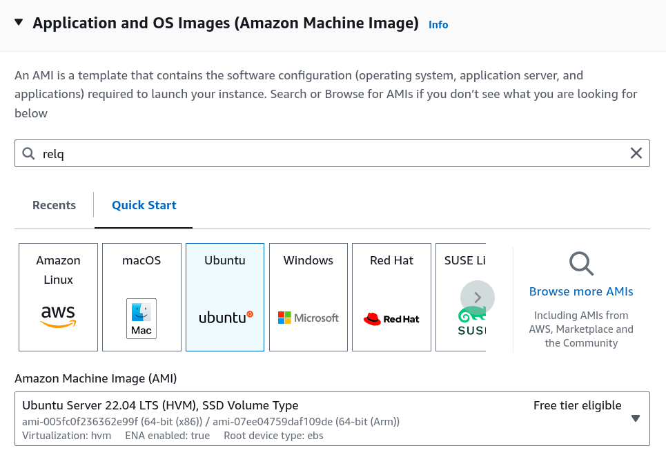
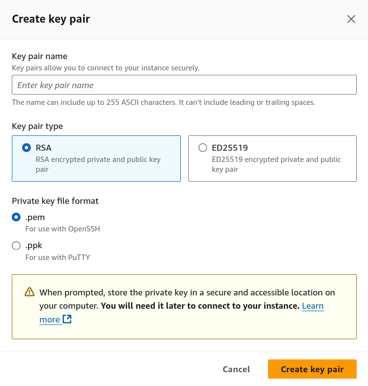
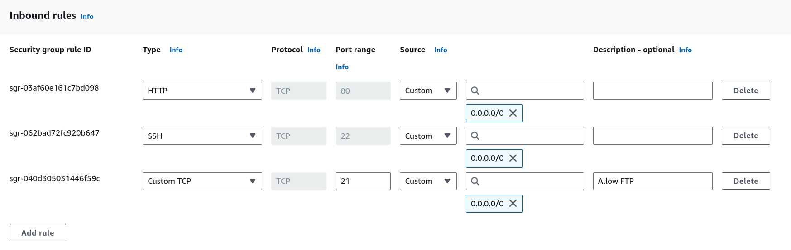

# First Project

This README provides instructions to securely configure and deploy a web server on an AWS instance. Following these steps will set up SSH access, configure firewalls, secure login settings, and install Apache for web hosting.

## Table of Contents
1. [Server Setup and SSH Configuration](#1-server-setup-and-ssh-configuration)
2. [Disable Password Authentication](#2-disable-password-authentication)
3. [Configure UFW Firewall](#3-configure-ufw-firewall)
4. [Configure AWS Security Group](#4-configure-aws-security-group)
5. [Install and Configure Fail2ban](#5-install-and-configure-fail2ban)
6. [Install and Configure Apache2](#6-install-and-configure-apache2)
7. [User Creation Script](#7-user-creation-script)
6. [Login Attempt Monitoring Script](#8-login-attempt-monitoring-script)

---

### 1) Server Setup and SSH Configuration
- **Create and log in to your server**:
  - Choose server distribution and version
    

  - Click the "Create new key pair" and setup ssh keys
    

  - Complete the setup by clicking "Launch instance"

  - SSH into the server using your AWS key pair:
    ```bash
    ssh -i /path/to/your-key.pem ubuntu@public_ip_address
    ```

### 2) Disable Password Authentication
For added security, disable password-based SSH logins.

- **Edit the SSH configuration**:
  ```bash
  sudo vim /etc/ssh/sshd_config
  ```
- **Set** `PasswordAuthentication` **to** `no`:
  ```plaintext
  PasswordAuthentication no
  ```
- **Restart the SSH service** to apply changes:
  ```bash
  sudo systemctl restart ssh
  ```

### 3) Configure UFW Firewall
Use UFW (Uncomplicated Firewall) to control access to specific ports.

- **Allow essential ports**:
  ```bash
  sudo ufw allow 21      # FTP
  sudo ufw allow 22      # SSH
  sudo ufw allow 80      # HTTP
  ```
- **Enable the firewall**:
  ```bash
  sudo ufw enable
  ```
- **Check firewall status**:
  ```bash
  sudo ufw status
  ```

### 4) Configure AWS Security Group
Manage firewall rules at the AWS level to allow only essential traffic.

- **Navigate to**: Security -> Security groups -> Edit inbound rules
- **Edit inbound rules**:
  - Allow **FTP (Port 21)**: Custom TCP, Port 21.
  - Allow **SSH (Port 22)**: Custom TCP, Port 22.
  - Allow **HTTP (Port 80)**: HTTP type.
  

### 5) Install and Configure Fail2ban
Fail2ban helps prevent unauthorized access by banning IPs with too many failed login attempts.

- **Install Fail2ban**:
  ```bash
  sudo apt install fail2ban
  ```
- **Start Fail2ban**:
  ```bash
  sudo systemctl start fail2ban
  ```
- **Verify Fail2ban status**:
  ```bash
  sudo systemctl status fail2ban
  ```
- **Edit Fail2ban configuration**:
  ```bash
  sudo vim /etc/fail2ban/jail.local
  ```
  - **Set** `maxretry` **to** `5`:
    ```plaintext
    maxretry = 5
    ```
  - **Set** `bantime` **to** `15m`:
    ```plaintext
    bantime = 15m
    ```

### 6) Install and Configure Apache2
Apache2 will serve as the web server for hosting content.

- **Install Apache2**:
  ```bash
  sudo apt install apache2
  ```
- **Enable and start Apache2**:
  ```bash
  sudo systemctl enable apache2
  sudo systemctl start apache2
  ```
- **Test Apache2**:
  - Locally: 
    ```bash
    curl http://localhost
    ```
  - Externally:
    - Open a browser and go to `http://public_ip_address` to verify Apache2 is running.

### 7) User Creation Script

This script creates a new user on the server with SSH access configured securely. It performs several tasks, including generating an SSH key pair, setting appropriate permissions, and adding the public key to `authorized_keys`.

#### Script Breakdown

1. **Prompt for Username**:
   - Prompts the administrator to enter the username for the new account.
   ```bash
   read -p "Write username: " username
   ```

2. **Create the User**:
   - Adds a new user with the specified username.
   ```bash
   sudo adduser $username
   ```

3. **Set Permissions for the Home Directory**:
   - Sets the home directory’s permissions to `700` for maximum security.
   ```bash
   sudo -u $username chmod 700 /home/"$username"
   ```

4. **Generate SSH Key Pair**:
   - Creates a new SSH key pair in the `.ssh` directory of the new user.
   - Sets `.ssh` permissions to `700` and `.pub` file permissions to `600` to secure the keys.
   ```bash
   sudo -u $username ssh-keygen -f /home/"$username"/.ssh/"$username"
   ```

5. **Set Up `authorized_keys`**:
   - Creates the `authorized_keys` file for the new user.
   - Sets permissions to `660` and appends the public key to this file to allow SSH access.
   ```bash
   sudo -u $username touch /home/"$username"/.ssh/authorized_keys
   ```

6. **Finalize Permissions**:
   - Sets `authorized_keys` to `600` to restrict access further.
   ```bash
   sudo -u $username chmod 600 /home/"$username"/.ssh/authorized_keys
   ```

This script automates the entire process of setting up a secure, SSH-accessible user account.

### 8) Login Attempt Monitoring Script

This script monitors recent login attempts from the system authentication log (`/var/log/auth.log`). It sends an email alert if it detects multiple failed login attempts within the last 15 lines of the log.

#### Script Breakdown

1. **Retrieve Last 15 Lines of the Auth Log**:
   - Reads the last 15 lines of `/var/log/auth.log` to check recent login attempts.
   ```bash
   all_logs=$(tail -n15 /var/log/auth.log)
   ```

2. **Count Failed Login Attempts**:
   - Counts occurrences of failed login attempts with "Connection closed by authenticating" to detect possible brute-force attempts.
   ```bash
   failed_logs=$(tail -n15 /var/log/auth.log | grep "Connection closed by authenticating" | wc -l)
   ```

3. **Send Email Alert if Failed Logins Exceed Threshold**:
   - If the number of failed attempts is 3 or more, it sends an alert email using `msmtp`.
   ```bash
   echo -e "Subject: Warning!\nSomeone is attempting to log in to the server." | msmtp andranikadyan@gmail.com
   ```

This monitoring script helps detect potential unauthorized access attempts, enabling quick response to possible security threats.